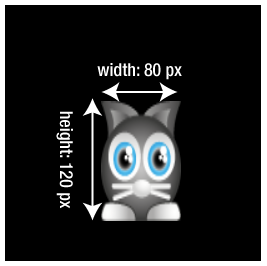
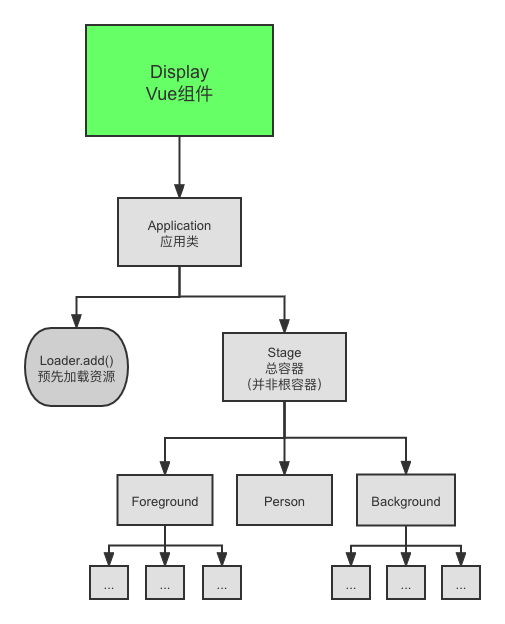

# Pixi 教程

根据 github 仓库 [kittykatattack/learningPixi](https://github.com/kittykatattack/learningPixi) 改编。专注于在 **Vue框架** 上实现该教程。并对其进行了精简。

这个教程会简单介绍如何使用 [Pixi](https://github.com/pixijs/pixi.js) 。该教程用的是（此时）的最新版本 **[Pixi v6.1.3](https://github.com/pixijs/pixijs/releases/tag/v6.1.3)**。

### 目录：

1. [安装](#settingup)
   1. [安装 Pixi](#installingpixi)
   
2. [创建舞台（stage）和画布（renderer）](#application)

3. [Pixi精灵](#sprite)

   1. [将图片加载到纹理缓存中](loadimage)

   2. [显示精灵](#showsprite)

   3. [使用别名 vs 按需导入](#aliases_vs_import)

   4. [一些加载的小知识](#loadtips)

      a. [监视加载进程](#progress)

4. [精灵属性](#spriteattributes)

   1. [位置](#position)
   2. [大小和比例](#size_and_scale)
   3. [旋转](#rotate)

5. [从雪碧图中创建精灵](#tileset)
   1. [创建雪碧图](#create_a_tileset)
   2. [使用雪碧图](#use_the_tileset)
   
6. [容器](#container)

7. [结语](#ending)


## <a id="settingup">安装</a>

首先，要创建一个 Vue 项目。你可以用 [Vue-cli](https://cli.vuejs.org/zh/guide/) 或 [Vite](https://vitejs.cn/guide/) 来快速搭建一个 Vue 项目。本教程使用了 Vite 来构建项目。

示例项目采用了 Vue2 + TypeScript。

而在教程中，我会尽量先用 JavaScript 代码阐释概念，再说明在 Vue 中要特别注意的地方。

使用 Vue-cli 生成项目： 

```bash
vue create my-vue-app
```

如果你想添加 TypeScript，请选择人工配置。

选择Vue.js 的版本时，选择2.x。

其他一路按默认配置选择就可以了。

等项目生成以后：

```bash
cd my-vue-app
npm run serve
```

这样就跑起来了一个 Vue 项目了。

### <a id="installingpixi">安装pixi</a>

进入你的项目，打开终端，输入如下命令：

```bash
npm install pixi.js --save
```


## <a id="application">创建Pixi应用和舞台</a>

Pixi应用：它是 Pixi 一切的基础。它会自动创建一个``<canvas>``HTML标签并计算出怎么让你的图片在其中显示。

舞台：PIXI.Application实例有一个`stage`属性。它是一个容器对象，也可以说是根容器。它“海纳百川”，最终所有的容器和精灵都会被添加到它身上。

以下代码创建了一个Pixi应用：

```javascript
// Create a Pixi Application
const app = new PIXI.Application({ width: 256, height: 256 })

// Add the canvas that Pixi automatically created for you to the HTML document
document.body.appendChild(app.view)
```

这是一份最基本的代码，其效果是一个宽高都为256像素的黑色canvas标签。效果如下：

 

一个应用可以有更多的初始化选项，如下：

```javascript
const app = new PIXI.Application({
	width: 256,                          // default: 800
	height: 256,                         // default: 600
	antialias: true,                     // default: false
	transparent: false,                  // default: false
	resolution: window.devicePixelRatio, // default: 1
})
```


## <a id="sprite">Pixi精灵</a>

先向你介绍 Pixi 精灵，既调动起你的兴趣，又不至于在介绍后续内容时束手束脚。

Pixi 精灵：一种特殊图像对象。你可以控制它们的位置、大小等属性来产生交互和动画。你可以把它们添加进 Pixi 容器对象。（当然可以是``app.stage``，因为它是根容器）

有3种主要的方式来创建一只精灵：

- 用一个**单图像**文件创建。
- 用一个**雪碧图**创建。雪碧图是一个放入了你游戏所需的多个图像的大图。
- 从一个纹理贴图集中创建。（纹理贴图集就是用 JSON 定义了图像大小和位置的雪碧图）

在学习精灵之前，你要学习如何用 Pixi 显示图片。


### <a id="loadimage">将图片加载到纹理缓存中</a>

首先，你需要将图片加载进来。Pixi 的 Loader.shared 对象可以加载任何你需要种类的图像资源。

例如，如果你有一个从``"./asstes/images/cat.png"``加载的图像，想把它加载进来：

```javascript
PIXI.Loader.shared.add('./assets/images/cat.png').load(setup)

function setup() {
	...
}
```

加载多个图片时，可以链式调用 add 方法：

```javascript
PIXI.Loader.shared
  .add('./assets/images/1.png')
  .add('./assets/images/2.png')
  .add('./assets/images/3.png')
```

也可以给 add 方法传入一个数组：

```javascript
PIXI.Loader.shared.add([
  './assets/images/1.png',
  './assets/images/2.png',
  './assets/images/3.png',
])
```

其次，需要将图片转化成 WebGL 纹理。可以被GPU处理的图像被称作 **纹理** 。为了效率，Pixi 使用 **纹理缓存** 来存储和引用纹理。纹理的名称字符串就是图像的地址。

你可以在纹理缓存中这样找到你加载的“猫咪”图片：

```javascript
const texture = PIXI.utils.TextureCache['images/cat.png']
```

最后用纹理来创建一个精灵示例：

```javascript
const cat = new PIXI.Sprite(texture)
```

另一种写法，连接 Loader.shared 的 resources 对象：

```javascript
const cat = new PIXI.Sprite(
  PIXI.Loader.shared.resources['./assets/images/cat.png']
)
```

**注意**：

1. 在 Vue 项目中，因为使用 webpack 进行打包，所以用 es6 导入图片资源

```typescript
import catPng from './assets/images/cat.png'

PIXI.Loader.shared.add(catPng).load(setup)

function setup() {
	const texture = PIXI.utils.TextureCache[catPng]
    const cat = new Sprite(texture)
}
```

2. 如果你在 TypeScript 下，发现导入图片报错，请在shims-tsx.d.ts文件中声明 资源后缀对应的模块：

```typescript
// png
declare module '*.png' {
  const a: string
  export default a
}
// jpg
declare module '*.jpg' {
  const a: string
  export default a
}
// csv
declare module '*.csv' {
  const a: string[][]
  export default a
}
```

3. 如果你在 Typescript 下，发现导入json报错，请在 tsconfig.json文件中 compilerOptions 属性中添加规则：

```ts
"resolveJsonModule": true,
```


### <a id="showsprite">显示精灵</a>

创建完精灵以后，别忘了把它加到容器中去。如：

```typescript
app.stage.addChild(cat)
```

如果想移走这个精灵：

```typescript
app.stage.removeChild(cat)
```

但通常，我们设置精灵的 visible 属性，来控制其可见/不可见：

```typescript
cat.visible = false
```


### <a id="aliases_vs_import">使用别名 vs 按需导入</a>

你可以对你使用频繁的Pixi对象和方法设置一些简略的可读性更强的别名。下面是一个给`TextureCache`对象创建别名的例子：

```js
let TextureCache = PIXI.utils.TextureCache
```

但在 vue 项目中（实际上在支持es6语法的项目中），我推荐你使用**按需导入**：

```js
import { utils } from 'pixi.js'

utils.Texture ...
```

这样可以避免默认导入整个pixi，从而减少一些空间。

如果你要默认导入，如下：

```js
import * as PIXI from 'pixi.js'
```


### <a id="loadtips">一些加载的小知识</a>

#### <a id="progress">监视加载进程</a>

Pixi的加载器有一个`progress`事件。你可以通过为该事件添加回调函数，在加载进程中做些什么事。

你可以通过`Loader.shared`的`on`方法调用`progress`事件：

```js
PIXI.Loader.shared.on('progress', loadProgressHandler)
```

接下来你可以在回调函数`loadProgressHandler`中监视加载进程：

- 该函数可以接收2个参数：loader和resource
- 你可以用`resource.url`找到已经被加载的文件。用`loader.progress`找到加载进度（百分比）

```js
function loadProgressHandler(loader, resource) {
	// 显示已被加载的文件 url
	console.log('loading: '+ resource.url)
	// 显示已被加载的百分比
	console.log('progress' + loader.progress + '%')
}
```


## <a id="spriteattributes">精灵属性</a>

### <a id="position">位置</a>

一开始，精灵们都被放置在其父容器的左上角，(0, 0)位置。你可以改变精灵的x, y的值来改变它的位置。

还记得之前的猫咪精灵吗，我们用它来做实验：

```
cat.x = 96
cat.y = 96
```

或者用一句话：

```js
cat.position.set(96, 96)
```

在创建完猫咪精灵后，把这两行代码放进`setup`方法

```js
import { Sprite, Loader } from 'pixi.js'

function setup() {
  const loader = Loader.shared
	// 创建一个猫咪精灵
	let cat = new Sprite(loader.resources['images/cat.png'].texture)
	
	// 改变它的位置
	cat.x = 96
	cat.y = 96
	
	// 把精灵添加到舞台上，让你能看见它
	app.stage.addChild(cat)
}
```

注意：

1. 我按需导入了`Sprite`和`Loader`。如果你选择默认导入，请写完整：`PIXI.Sprite`和`PIXI.Loader.shared.resources`

2. x轴和y轴的正方向如下：


### <a id="size_and_scale">大小和比例</a>

你可以通过精灵的`width`和`height`属性来改变它的大小。此时它的位置（左上角）是不会改变的。

```js
cat.width = 80
cat.height = 120
```

效果：



当然你也可以设置精灵的`scale.x`和`scale.y`属性，成比例地改变它的宽高。

以下代码将精灵的大小等比缩小成一半：

```js
cat.scale.x = 0.5
cat.scale.y = 0.5
```

或者一句话：

```js
cat.scale.set(0.5, 0.5)
```


### <a id="rotate">旋转</a>

你可以设置精灵的`rotation`来指定它**围绕锚点**顺时针旋转的角度：

```js
cat.rotation = 0.5
```

效果如下：


默认锚点在精灵的左上角，你可以设置`anchor.x`和`anchor.y`来改变锚点的位置：

```js
cat.anchor.x = 0.5
cat.anchor.y = 0.5
```

`anchor.x`和`anchor.y`一般是从0到1，表示相对整个纹理的长度/宽度的比例。比如0.5就把`anchor`设置到了中心。

注意：把`anchor`设置到中心，在旋转时会间接改变精灵的位置。如下：

 


`pivot`是和`anchor`差不多的属性，只不过它表示的是精灵的**原点**。（你还记得它默认在左上角(0, 0)位置吗）。

```js
cat.pivot.set(32, 32)
```

如果精灵图是 64x64像素大，以上这样设置时，它也会绕中心旋转。


`anchor`表示精灵的锚点，一般值从0到1。

`pivot`表示精灵的原点，一般值以像素为单位。


## <a id="tileset">从雪碧图中创建精灵</a>

### <a id="create_a_tileset">创建雪碧图</a>

推荐一个好用的软件：[TexturePacker](https://www.codeandweb.com/texturepacker)

下载以后，使用它的免费版。

之后，你可以用它来将很多图片合成一个精灵表。


你可以将你需要的图片拖到里面，它会自动合成一张雪碧图：


如果你想导出雪碧图，点击上方工具栏的发布精灵表，并把它保存到合适的地方。

- 导出的文件有两个：.png和.json。.png是完整的雪碧图，而.json帮助记录每张子图在整图的位置和其他信息。
- 如果你保存了原项目，它的后缀是.tps


### <a id="use_the_tileset">使用雪碧图</a>

这个时候，.json文件就有用处了。我们需要先导入.png和.json文件。以上面的treasure为例：

```js
import treasurePng from '../assets/resources/treasure.png'
import treasureJson from '../assets/resources/treasure.json'
```

接下来，我们按之前的知识，加载图片到纹理缓存 TextureCache 中：

```js
const loader = PIXI.Loader.shared
loader.add(treasurePng).load(setup)

function setup() {
  ...
}
```

接着，我们要根据纹理缓存中的图片资源和导入的json资源创建 Spritesheet：

```js
import { Spritesheet } from 'pixi.js'

...
const spritesheet = new Spritesheet(TextureCache[resources.treasure], treasureJson)
```

最后，解析spritesheet：

```js
spritesheet.parse(() => {
  // 解析后，这里可以进行精灵的创建等
  ...
})
```

以上是在webpack下的解决方法。以上步骤解析了整个雪碧图的信息。


接下来，如果你想从雪碧图中截取一张子图作为纹理，创建一个**静态**精灵，如下：

```js
import { Sprite } from 'pixi.js'

...
const door = new Sprite(spritesheet.textures['door.png'])
```

注意：调用 spritesheet 的`textures`属性，索引值是.json文件中子图的名称。（一般也是你创建雪碧图时拖入子图的名称）


而如果你想要创建一个**动态**精灵。

- 首先，你需要在创建雪碧图时，拖入一系列名称相近的图片——它们可以代表精灵的一个动作。如：

  ```js
  person-front-1.png person-front-2.png person-front-3.png // 用这3张图表示人物正面行走动作
  ```

- 接着，在导出.json文件后，它会自动将这些名字相近的图片加进`animations`字段的某一属性的数组中。这个属性名一般是这一系列图片相同的名字前缀。

  ```json
  "animations": {
  	"front": ["person-front-1.png","person-front-2.png","person-front-3.png"]
  }
  ```

  （当然，你也可以在.json文件中手动修改这一字段，相当于自定义这一属性的动画帧）

- 接着，在代码中创建动态精灵：

```js
import { AnimatedSprite } from 'pixi.js'

...
const person = new AnimatedSprite(spritesheet.animations['front'])
```

注意：调用 spritesheet 的`animations`属性，索引值为.json文件中对应id。


## <a id="container">容器</a>

还记得 Pixi 应用的 `stage` 属性就是一个容器吗？

Pixi 容器就像一个盒子。在编写 Pixi 代码时，你可以基于一个个容器来构建层级：

- 父容器可以容纳子容器
- 父容器可以容纳精灵

你可以通过调用`addChild()`方法来容纳容器/精灵：

```js
import { Container } from 'pixi.js'

const container = new Container()
// 我们假设可爱的猫咪精灵已经在之前生成了
container.addChild(cat)
```

你也可以将容器看作一个精灵，因为你也可以改变其位置和原点。

```js
// 改变一个容器相对于其父容器的位置
container.x = 96
container.y = 96
// 改变其原点
container.pivot.set(32, 32)
```

在工程化实践中，我们常常把自己的类继承自`PIXI.Container`，在调用`this.addChild()`将生成的精灵添加到自己的实例中。这是一种较好的实践思路。如：

```typescript
import { Container, Spritesheet, Sprite } from 'pixi.js'

export class Cat extends Container { // 继承 PIXI.Container
	private spritesheet: Spritesheet
	constructor(spritesheet: Spritesheet) {
		this.spritesheet = spritesheet
    // 生成精灵
    const cat = new Sprite(spritesheet.textures['cat.png'])
    // 把精灵添加到类实例
    this.addChild(cat)
	}
}
```


### <a id="practice">一些习惯</a>

在构建 Vue + Pixi 的项目时，有一条推荐的思路：

- 在一个 Vue 组件（不如叫它 `Display`）中持有一个 js / ts 类（不如叫它 `Application`）作为`Pixi.application`的入口。

- 接下来，在`Application`类中，
  - 用`Pixi.Loader`预先加载资源。
  - 持有一个`Stage`类作为“最大“的容器，作为展示舞台（并把它添加到 根容器 `app.stage` 中）
- 在`Stage`类中，构建 Pixi 的容器层级结构。（记得用自己的类继承`Pixi.Container`，以下称其为容器类）

  **注意**：

- 为了 ”**预先加载资源**“ 和 ”**构建展示舞台**“ 这2步分开，构建了`Application`类作为缓冲。如果你的容器层级不那么复杂，可以跳过构建这个类。




## <a id="ending">结语</a>

其实说到这里，以上的知识已经可以支持你的平常开发了。

如果你想要进一步了解 Pixi，请移步：

1. 英文版教程 [kittykatattack/learningPixi](https://github.com/kittykatattack/learningPixi)
2. 官网 [PixiJS](https://pixijs.com/)

以下是一些有用的 Pixi 库：

- pixi-viewport
- pixi-live2d-display
- pixi-particles
- pixi-sound
